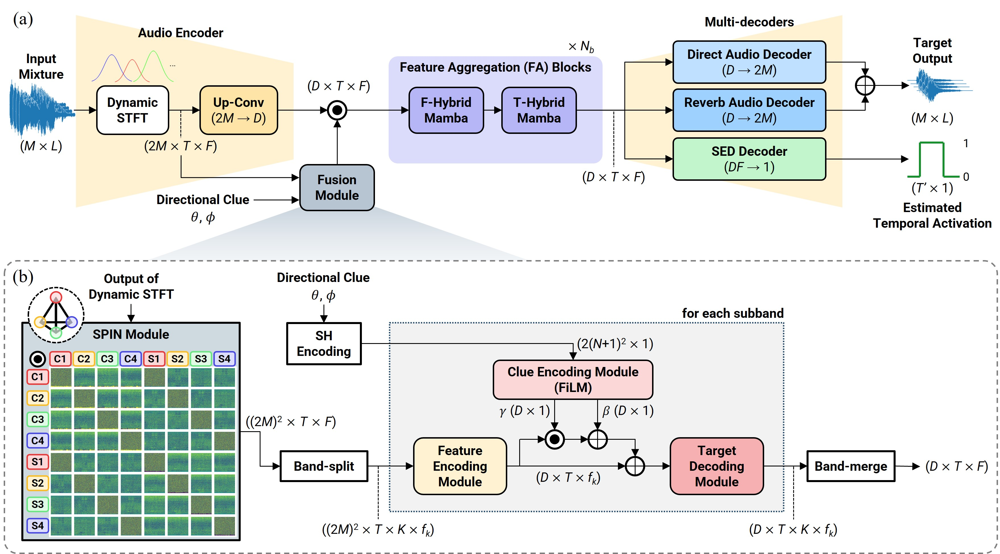
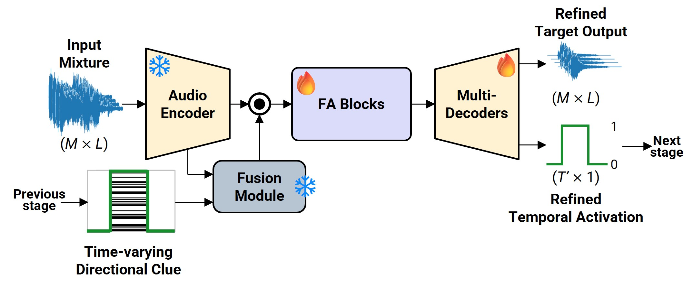

# SoundCompass

<!-- 
 -->

### __Dayun Choi__ and __Jung-Woo Choi__*

This repository provides the codes for the paper titled by "__SoundCompass: Navigating Target Sound Extraction With Effective Directional Clue Integration In Complex Acoustic Scenes__," accepted to ICASSP 2026. Codes will be released soon!

## Abstract

*Recent advances in target sound extraction (TSE) utilize directional clues derived from direction of arrival (DoA), which represent an inherent spatial property of sound available in any acoustic scene. However, previous DoA-based methods rely on hand-crafted features or discrete encodings, which lose fine-grained spatial information and limit adaptability. We propose SoundCompass, an effective directional clue integration framework centered on a Spectral Pairwise INteraction (SPIN) module that captures cross-channel spatial correlations in the complex spectrogram domain to preserve full spatial information in multichannel signals. The input feature expressed in terms of spatial correlations is fused with a DoA clue represented as spherical harmonics (SH) encoding. The fusion is carried out across overlapping frequency subbands, inheriting the benefits reported in the previous band-split architectures. We also incorporate the iterative refinement strategy, chain-of-inference (CoI), in the TSE framework, which recursively fuses DoA with sound event activation estimated from the previous inference stage. Experiments demonstrate that SoundCompass, combining SPIN, SH embedding, and CoI, robustly extracts target sources across diverse signal classes and spatial configurations.*

## Model architecture

Overall architecture of SoundCompass for DoA-based target sound extraction.

Details of iterative refinement.

  

    
  

## Training & Evaluation

(TBA)

## Note

Some components of this repository are based on and modified from [DeepASA](https://github.com/donghoney0416/DeepASA). This repository is licensed under the GNU General Public License v2.0, and you can see the `LICENSE` file.

## Citation

    @inproceedings{choi2026soundcompass,
        title={{SoundCompass}: Navigating Target Sound Extraction With Effective Directional Clue Integration In Complex Acoustic Scenes},
        author={Choi, Dayun and Choi, Jung-Woo},
        booktitle={Proceedings of the 2026 IEEE International Conference on Acoustics, Speech, and Signal Processing (ICASSP)},
        pages={1--5},
        year={2026},
        month={May},
        organization={IEEE},
        address="Barcelona, Spain"
    }
